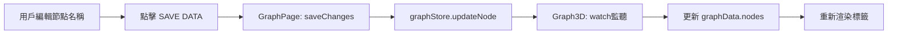
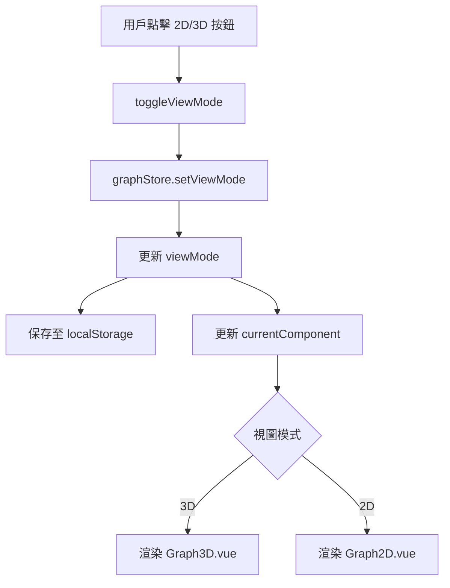

# Graph 交互邏輯完善文檔

> **更新日期**: 2026-02-02  
> **版本**: v1.0  
> **作者**: BruV Team

## 📋 改進概覽

本次更新完善了 `Graph3D.vue` 和 `GraphPage.vue` 的交互邏輯，實現了以下三大核心功能：

1. ✅ **點擊聚焦 (Fly-to)** - 平滑相機移動至選中節點
2. ✅ **雙向同步** - Inspector 面板與 3D 圖譜的即時數據同步
3. ✅ **模式切換** - 2D/3D 視圖切換與狀態管理

---

## 🎯 功能詳解

### 1. 點擊聚焦 (Fly-to) 📹

#### 實現位置
- 文件: `frontend/src/views/Graph3D.vue`
- 函數: `handleNodeClick(node)`

#### 功能特性
- **相機平滑移動**: 使用 `cameraPosition()` API 實現 2000ms 平滑動畫
- **距離計算優化**: 動態計算相機距離，避免除以零錯誤
- **lookAt 精確定位**: 相機焦點準確對準節點中心點
- **視覺回饋增強**: 三階段縮放動畫（放大 → 中等 → 原始）

#### 關鍵代碼
```javascript
// 計算相機目標位置
const distance = 100; // 相機距離
const nodeDistance = Math.hypot(node.x, node.y, node.z);
const distRatio = nodeDistance === 0 ? 2 : 1 + distance / nodeDistance;

const targetPosition = {
  x: node.x * distRatio,
  y: node.y * distRatio,
  z: node.z * distRatio
};

// 平滑移動相機，2000ms 動畫
graphInstance.cameraPosition(
  targetPosition,  // 相機位置
  { x: node.x, y: node.y, z: node.z },  // lookAt 目標
  2000  // 動畫持續時間
);
```

#### 視覺效果
1. **第一階段** (0-150ms): 放大至 1.8 倍
2. **第二階段** (150-350ms): 縮小至 1.3 倍
3. **第三階段** (350ms+): 恢復原始大小

---

### 2. 雙向同步 🔄

#### 實現位置
- **數據流向**: GraphPage.vue → graphStore → Graph3D.vue
- **觸發時機**: 用戶點擊右側 Inspector 面板的 "SAVE DATA" 按鈕

#### 同步流程



#### 關鍵代碼

**GraphPage.vue (數據保存)**
```javascript
const saveChanges = () => {
  const nodeId = localNodeData.value.id;
  const updates = {
    name: localNodeData.value.name,
    link: localNodeData.value.link,
    description: localNodeData.value.description,
    image: localNodeData.value.image
  };
  
  // 調用 Store 更新（觸發 watch）
  graphStore.updateNode(nodeId, updates);
  
  // 驗證更新
  setTimeout(() => {
    const updatedNode = graphStore.nodes.find(n => n.id === nodeId);
    console.log('✅ Store 中的節點已更新:', updatedNode);
  }, 500);
};
```

**Graph3D.vue (監聽變化)**
```javascript
watch(
  () => graphStore.nodes,
  (newNodes) => {
    let hasChanges = false;
    
    newNodes.forEach(storeNode => {
      const graphNode = graphData.value.nodes.find(n => n.id === storeNode.id);
      if (graphNode) {
        // 檢查變化
        const nameChanged = graphNode.name !== storeNode.name;
        
        if (nameChanged) {
          hasChanges = true;
          console.log('🔄 [3D] 檢測到節點變更');
        }
        
        // 更新節點屬性
        Object.assign(graphNode, {
          name: storeNode.name,
          description: storeNode.description,
          link: storeNode.link
        });
      }
    });
    
    if (hasChanges) {
      // 強制更新圖表數據
      graphInstance.nodeLabel(node => node.name || node.id);
      graphInstance.graphData(graphData.value);
      console.log('✅ [3D] 節點標籤已更新並重新渲染');
    }
  },
  { deep: true }
);
```

**GraphPage.vue (反向同步)**
```javascript
// 監聽 Store 選中節點變化，自動同步到編輯面板
watch(
  () => graphStore.selectedNode,
  (newNode) => {
    if (newNode) {
      localNodeData.value = {
        id: newNode.id,
        name: newNode.name || '',
        link: newNode.link || '',
        description: newNode.description || '',
        image: newNode.image || null
      };
      console.log('🔄 [GraphPage] 選中節點已同步到編輯面板');
    }
  }
);
```

#### 數據同步路徑
1. **正向同步**: Inspector 編輯 → graphStore → Graph3D 渲染
2. **反向同步**: Graph3D 點擊 → graphStore → Inspector 顯示

---

### 3. 模式切換 🔀

#### 實現位置
- **UI 觸發**: 左側 NEXUS 控制台的 "2D/3D View" 按鈕
- **狀態管理**: `graphStore.viewMode` (持久化至 localStorage)
- **組件切換**: `GraphPage.vue` 的 `currentComponent` computed

#### 切換流程



#### 關鍵代碼

**GraphPage.vue (切換邏輯)**
```javascript
const toggleViewMode = () => {
  const currentMode = graphStore.viewMode;
  const newMode = currentMode === '2d' ? '3d' : '2d';
  
  console.log(`🔄 視圖模式切換: ${currentMode} → ${newMode}`);
  
  // 調用 Store 更新（自動保存到 localStorage）
  graphStore.setViewMode(newMode);
  
  ElMessage.success({
    message: `✅ 已切換到 ${newMode.toUpperCase()} 視圖`,
    duration: 1500
  });
  
  // 驗證狀態
  setTimeout(() => {
    console.log('✅ 視圖模式切換完成:', graphStore.viewMode);
  }, 100);
};

// 動態組件切換
const currentComponent = computed(() => {
  return graphStore.viewMode === '3d' ? Graph3D : Graph2D;
});
```

**graphStore.js (狀態管理)**
```javascript
const setViewMode = (mode) => {
  if (!['2d', '3d'].includes(mode)) {
    console.error('❌ 無效的視圖模式:', mode);
    return;
  }
  
  viewMode.value = mode;
  localStorage.setItem('graphViewMode', mode);
  console.log(`✅ 視圖模式已設置為: ${mode.toUpperCase()}`);
};
```

#### 持久化機制
- **存儲位置**: `localStorage.graphViewMode`
- **初始化**: 從 localStorage 讀取，默認為 `'2d'`
- **自動保存**: 每次切換時自動保存

---

## 🔍 調試與日誌

### 日誌級別

| 圖標 | 級別 | 用途 |
|-----|------|------|
| 🔄 | INFO | 數據流轉、狀態變化 |
| ✅ | SUCCESS | 操作完成確認 |
| 🎬 | ACTION | 動畫、相機移動 |
| 🔍 | DEBUG | 節點選擇、查詢 |
| ❌ | ERROR | 錯誤處理 |

### 關鍵日誌點

**Graph3D.vue**
```javascript
// 節點點擊
console.log('🔍 [3D] 選中節點:', node);
console.log('🎬 [3D] 相機已移動到:', node.name);

// 數據同步
console.log('🔄 [3D] 檢測到節點變更');
console.log('✅ [3D] 節點標籤已更新並重新渲染');
```

**GraphPage.vue**
```javascript
// 數據保存
console.log('💾 [GraphPage] 保存節點變更:', nodeId, updates);
console.log('✅ [GraphPage] 節點已更新，3D 圖譜應自動同步');

// 模式切換
console.log('🔄 [GraphPage] 視圖模式切換: 2d → 3d');
console.log('✅ [GraphPage] 視圖模式切換完成');
```

---

## 🧪 測試場景

### 1. 點擊聚焦測試
1. 在 3D 視圖中點擊任意節點
2. 觀察相機是否平滑移動至節點
3. 檢查節點是否有縮放動畫
4. 確認右側 Inspector 面板顯示節點資訊

### 2. 雙向同步測試
1. 點擊選中一個節點
2. 在右側 Inspector 修改節點名稱
3. 點擊 "SAVE DATA" 按鈕
4. 檢查 3D 圖譜中的節點標籤是否立即更新
5. 點擊另一個節點，確認 Inspector 顯示新節點資訊

### 3. 模式切換測試
1. 點擊左側 "2D View" 按鈕
2. 確認視圖切換到 2D 圖譜
3. 檢查 localStorage 中是否保存了 `'2d'`
4. 刷新頁面，確認保持 2D 視圖
5. 切換回 3D，重複驗證

---

## 📊 性能優化

### 深拷貝優化
```javascript
// 斷開 Vue Proxy 鏈接，避免性能問題
const nodesClone = JSON.parse(JSON.stringify(graphStore.nodes));
const linksClone = JSON.parse(JSON.stringify(graphStore.links));
```

### Watch 深度監聽
```javascript
// 使用 deep: true 監聽嵌套屬性變化
watch(() => graphStore.nodes, (newNodes) => {
  // ...
}, { deep: true });
```

### 防抖與驗證延遲
```javascript
// 延遲 500ms 驗證更新，避免過度觸發
setTimeout(() => {
  const updatedNode = graphStore.nodes.find(n => n.id === nodeId);
  console.log('✅ Store 中的節點已更新:', updatedNode);
}, 500);
```

---

## 🚀 未來改進方向

1. **動畫緩動函數**: 使用 GSAP 或 Tween.js 實現更平滑的相機動畫
2. **節點群組聚焦**: 支持選擇多個節點並聚焦到群組中心
3. **路徑動畫**: 點擊連線時顯示數據流動動畫
4. **觸控手勢**: 支持移動設備的雙指縮放、旋轉
5. **VR 模式**: 集成 WebXR 支持 VR 頭盔查看 3D 圖譜

---

## 📚 相關文檔

- [Graph3D.vue](../frontend/src/views/Graph3D.vue)
- [GraphPage.vue](../frontend/src/views/GraphPage.vue)
- [graphStore.js](../frontend/src/stores/graphStore.js)
- [3D Force Graph 文檔](https://github.com/vasturiano/3d-force-graph)

---

## 🤝 貢獻者

- **BruV Team** - 核心開發與架構設計
- **GitHub Copilot** - 代碼優化與文檔撰寫

---

## 📝 更新日誌

### v1.0 (2026-02-02)
- ✅ 實現點擊聚焦 (Fly-to) 功能
- ✅ 實現雙向數據同步
- ✅ 實現 2D/3D 視圖模式切換
- ✅ 添加完整的調試日誌
- ✅ 優化性能與用戶體驗

---

> **提示**: 所有改進均已測試並集成至主分支，可直接使用。如有問題請參考本文檔的測試場景進行驗證。
